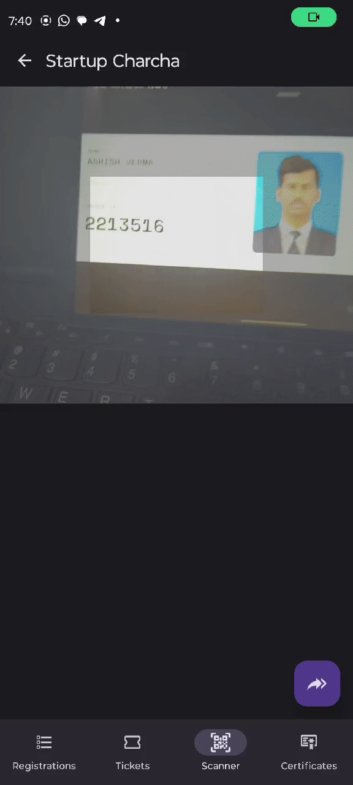

# EventEasy 🎉

EventEasy is a streamlined React Native app designed to make event management simple and efficient. It allows organizers to handle event registrations and ticketing with ease. Import registrations, generate tickets, scan QR codes, and track attendance seamlessly — all with a user-friendly Material Design interface.

## Features 📋

### Completed
- **Import CSV of Registrations**: Effortlessly import CSV files containing participant information to a sqlite database and list all registrations in the app.
- **Scanner with QR Code Support**: Quickly scan participants’ tickets via QR codes and verify attendance.
- **Export Attendance as CSV**: Save and export scanned participant data in a separate CSV file for further use.

### Roadmap
- **Ticket Generation with QR Codes**: Generate a unique QR-coded ticket for each registration.
- **Email Tickets to Participants**: Automatically email generated tickets to registered participants.

> Note: The QR codes are generated using JWT tokens, which provide secure encoding for ticket verification, ensuring tokens cannot be forged.

## Screenshots 📸

<p float="left">
   
   
   
</p>

## Getting Started 🚀

Follow these instructions to get a local copy up and running.

### Prerequisites
- **Node.js** and **npm**
- **Expo CLI**

### Installation
1. Clone the repository:
   ```bash
   git clone https://github.com/yourusername/EventEasy.git
   cd EventEasy
   ```

2. Install dependencies:
   ```bash
   npm install
   ```

3. Start the app:
   ```bash
   npx expo run  # For Android
   npx expo start
   ```

4. For best results, run on a physical device to use the QR code scanner feature.

## Usage 📲

1. **Import Registrations**: Select a CSV file having columns `Name`, `Email`, `Roll` details to import.
2. **View Registrations**: Browse imported participant data in a structured list.
3. **Scan Tickets**: Use the QR scanner to verify tickets encoded with JWT tokens.
4. **Export Attendance**: Save the attendance records into a separate CSV for easy sharing or further processing.

## Contributing 🤝

We welcome contributions! For detailed guidelines, please refer to [CONTRIBUTING.md](./CONTRIBUTING.md).

## Roadmap 🛤️

We have exciting features in the pipeline:
- **Multiple Events Management**: Currently, the list navigates to same database table.
- **Automated Ticket Generation**: Generate QR-coded tickets for each participantin mobile-only.
- **Email Ticket Distribution**: Automatically email tickets to registered participants.

## License 📝

This project is licensed under the MIT License - see the [LICENSE](LICENSE) file for details.

